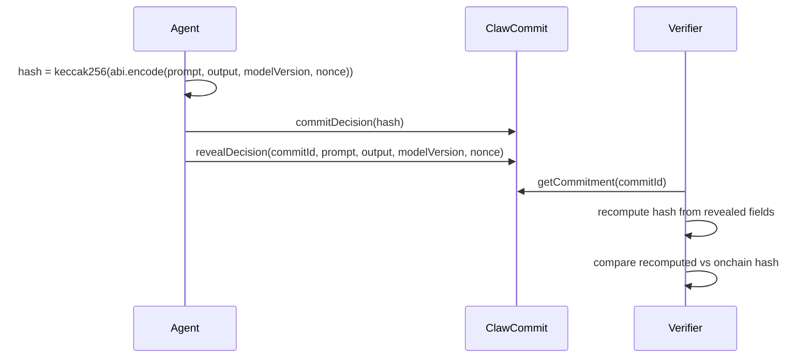

# ClawCommit: Technical Specification (V2)

## 1. Architecture

ClawCommit splits into:
- Onchain deterministic commitment storage (`contracts/ClawCommit.sol`)
- Offchain commit/reveal operators (`scripts/commit.ts`, `scripts/reveal.ts`)
- Offchain independent replay verifier (`scripts/replay.ts`)



## 2. Contract Interface

### Commitment struct

- `hash: bytes32`
- `timestamp: uint256`
- `committer: address`
- `revealed: bool`
- `prompt: string`
- `output: string`
- `modelVersion: string`
- `nonce: string`

### Public functions

- `commitDecision(bytes32 commitHash) returns (uint256 commitId)`
- `revealDecision(uint256 commitId, string prompt, string output, string modelVersion, string nonce)`
- `getCommitment(uint256 commitId) returns (Commitment)`
- `verifyReplay(uint256 commitId) returns (bool)`
- `computeDecisionHash(string prompt, string output, string modelVersion, string nonce) returns (bytes32)`

### Security controls

- `OnlyCommitter` custom error on unauthorized reveal.
- `AlreadyRevealed` custom error on second reveal.
- `HashMismatch` custom error if revealed fields differ from committed hash.
- `NotRevealed` custom error when verifying unrevealed commitments.

## 3. Deterministic Hashing

### Canonical formula

`keccak256(abi.encode(prompt, output, modelVersion, nonce))`

This intentionally uses `abi.encode` (not packed encoding) to keep deterministic typed encoding for the replay path.

### JavaScript equivalent

```ts
const encoded = AbiCoder.defaultAbiCoder().encode(
  ["string", "string", "string", "string"],
  [prompt, output, modelVersion, nonce]
);
const hash = keccak256(encoded);
```

## 4. Replay Model

Standalone verifier command:

```bash
npx ts-node scripts/replay.ts --tx 0xREVEAL_TX_HASH
```

Verifier behavior:
1. Fetch transaction and receipt from BSC RPC.
2. Require successful onchain execution (`receipt.status === 1`).
3. Decode `revealDecision` calldata into `commitId/prompt/output/modelVersion/nonce`.
4. Recompute deterministic hash offchain.
5. Read original `hash` from `getCommitment(commitId)` at `tx.to`.
6. Compare hashes and print success/failure.

Why this matters:
- Third parties can verify integrity independently.
- No trust required in operator infrastructure.
- Determinism is externally auditable and reproducible.

## 5. Setup & Run

### Prerequisites

- Node.js 18+
- npm

### Install and test

```bash
npm install
npx hardhat compile
npm test
```

### Mainnet deployment (alias: `bsc`)

```bash
npx hardhat run scripts/deploy.ts --network bsc
```

### Commit / reveal

```bash
npx hardhat run scripts/commit.ts --network bsc -- \
  --contract <CONTRACT_ADDRESS> \
  --prompt "Should we rebalance treasury?" \
  --output "APPROVE_REBALANCE" \
  --model-version "clawcommit-v2.0" \
  --nonce "nonce-123"

npx hardhat run scripts/reveal.ts --network bsc -- \
  --contract <CONTRACT_ADDRESS> \
  --commit-id <ID> \
  --prompt "Should we rebalance treasury?" \
  --output "APPROVE_REBALANCE" \
  --model-version "clawcommit-v2.0" \
  --nonce "nonce-123"
```

### Replay verification

```bash
npx ts-node scripts/replay.ts --tx 0xREVEAL_TX_HASH
```

### One-shot proof generation

```bash
npx hardhat run scripts/deployAndProve.ts --network bsc
```

Outputs:
- `deployment-proof/contract.txt`
- `deployment-proof/deploy-tx.txt`
- `deployment-proof/commit-tx.txt`
- `deployment-proof/reveal-tx.txt`

## 6. BSC Configuration

`hardhat.config.ts` includes:
- `bsc` (mainnet alias, chainId 56)
- `bscMainnet` (existing mainnet name, chainId 56)
- `bscTestnet` (chainId 97)

Required env vars:
- `BSC_RPC_URL`
- `DEPLOYER_PRIVATE_KEY`
- `BSCSCAN_API_KEY`

## 7. Merkle Batching (Wave 1)

Wave 1 introduces root-level batch commitments in `contracts/ClawCommitBatch.sol`.

### Batch commitment interface

- `commitBatch(bytes32 merkleRoot, uint32 leafCount, string modelVersion, bytes32 manifestHash) returns (uint256 batchId)`
- `getBatch(uint256 batchId) returns (BatchCommitment)`
- `computeLeafHash(string prompt, string output, string modelVersion, string nonce, uint256 leafIndex) returns (bytes32)`

### Canonical hashing rules

- Leaf hash:
  - `keccak256(abi.encode(prompt, output, modelVersion, nonce, leafIndex))`
- Parent hash:
  - `keccak256(abi.encode(left, right))`
- Odd-width levels:
  - duplicate the last node in the level.
- Leaf order:
  - strictly ascending by `leafIndex`.

### Manifest and tooling

Wave 1 scripts:
- `scripts/batch/build.ts` - build `clawcommit-batch-v1` manifest from NDJSON.
- `scripts/batch/recomputeRoot.ts` - recompute and validate manifest root.
- `scripts/batch/commitBatch.ts` - commit root onchain.
- `scripts/batch/getBatch.ts` - read committed batch metadata.

Commands:

```bash
npx ts-node scripts/batch/build.ts \
  --in data/decisions-batch-001.ndjson \
  --out artifacts/batches/batch-001.manifest.json \
  --model-version clawcommit-v2.0

npx ts-node scripts/batch/recomputeRoot.ts \
  --manifest artifacts/batches/batch-001.manifest.json

npx hardhat run scripts/batch/commitBatch.ts --network bsc -- \
  --contract <BATCH_CONTRACT_ADDRESS> \
  --manifest artifacts/batches/batch-001.manifest.json

npx hardhat run scripts/batch/getBatch.ts --network bsc -- \
  --contract <BATCH_CONTRACT_ADDRESS> \
  --batch-id 0
```
