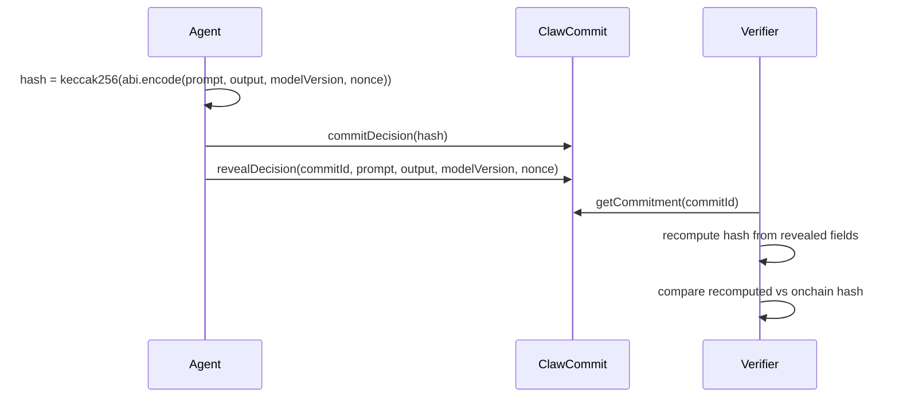

# ClawCommit: Technical Specification (V2)

## 1. Architecture

ClawCommit splits into:
- Onchain deterministic commitment storage (`contracts/ClawCommit.sol`)
- Offchain commit/reveal operators (`scripts/commit.ts`, `scripts/reveal.ts`)
- Offchain independent replay verifier (`scripts/replay.ts`)



## 2. Contract Interface

### Commitment struct

- `hash: bytes32`
- `timestamp: uint256`
- `committer: address`
- `revealed: bool`
- `prompt: string`
- `output: string`
- `modelVersion: string`
- `nonce: string`

### Public functions

- `commitDecision(bytes32 commitHash) returns (uint256 commitId)`
- `revealDecision(uint256 commitId, string prompt, string output, string modelVersion, string nonce)`
- `getCommitment(uint256 commitId) returns (Commitment)`
- `verifyReplay(uint256 commitId) returns (bool)`
- `computeDecisionHash(string prompt, string output, string modelVersion, string nonce) returns (bytes32)`

### Security controls

- `OnlyCommitter` custom error on unauthorized reveal.
- `AlreadyRevealed` custom error on second reveal.
- `HashMismatch` custom error if revealed fields differ from committed hash.
- `NotRevealed` custom error when verifying unrevealed commitments.

## 3. Deterministic Hashing

### Canonical formula

`keccak256(abi.encode(prompt, output, modelVersion, nonce))`

This intentionally uses `abi.encode` (not packed encoding) to keep deterministic typed encoding for the replay path.

### JavaScript equivalent

```ts
const encoded = AbiCoder.defaultAbiCoder().encode(
  ["string", "string", "string", "string"],
  [prompt, output, modelVersion, nonce]
);
const hash = keccak256(encoded);
```

## 4. Replay Model

Standalone verifier command:

```bash
npx ts-node scripts/replay.ts --tx 0xREVEAL_TX_HASH
```

Verifier behavior:
1. Fetch transaction and receipt from BSC RPC.
2. Require successful onchain execution (`receipt.status === 1`).
3. Decode `revealDecision` calldata into `commitId/prompt/output/modelVersion/nonce`.
4. Recompute deterministic hash offchain.
5. Read original `hash` from `getCommitment(commitId)` at `tx.to`.
6. Compare hashes and print success/failure.

Why this matters:
- Third parties can verify integrity independently.
- No trust required in operator infrastructure.
- Determinism is externally auditable and reproducible.

## 5. Setup & Run

### Prerequisites

- Node.js 20.x (see `.nvmrc`)
- npm

### Install and test

```bash
npm install
npx hardhat compile
npm test
```

### Mainnet deployment (alias: `bsc`)

```bash
npx hardhat run scripts/deploy.ts --network bsc
```

### Commit / reveal

```bash
HARDHAT_NETWORK=bscTestnet npx ts-node scripts/commit.ts \
  --contract <CONTRACT_ADDRESS> \
  --prompt "Should we rebalance treasury?" \
  --output "APPROVE_REBALANCE" \
  --model-version "clawcommit-v2.0" \
  --nonce "0x<32-byte-hex-nonce>" \
  --log-sensitive true

HARDHAT_NETWORK=bscTestnet npx ts-node scripts/reveal.ts \
  --contract <CONTRACT_ADDRESS> \
  --commit-id <ID> \
  --prompt "Should we rebalance treasury?" \
  --output "APPROVE_REBALANCE" \
  --model-version "clawcommit-v2.0" \
  --nonce "0x<32-byte-hex-nonce>" \
  --log-sensitive true
```

Mainnet writes require explicit opt-in:

```bash
--allow-mainnet-writes true
```

### Replay verification

```bash
npx ts-node scripts/replay.ts --tx 0xREVEAL_TX_HASH
```

### One-shot proof generation

```bash
npx hardhat run scripts/deployAndProve.ts --network bsc
```

Outputs:
- `deployment-proof/contract.txt`
- `deployment-proof/deploy-tx.txt`
- `deployment-proof/commit-tx.txt`
- `deployment-proof/reveal-tx.txt`

## 6. BSC Configuration

`hardhat.config.ts` includes:
- `bsc` (mainnet alias, chainId 56)
- `bscMainnet` (existing mainnet name, chainId 56)
- `bscTestnet` (chainId 97)

Required env vars:
- `BSC_RPC_URL`
- `DEPLOYER_PRIVATE_KEY`
- `BSCSCAN_API_KEY`

## 7. OpenClaw Native Profile

OpenClaw Native is an additive profile that maps CI validation outcomes into deterministic ClawCommit decisions.

### OpenClaw payload model

Input:
- `modelVersion`
- `context` (`workflow`, `repository`, optional `ref`, `sha`, `actor`, `runId`, `runUrl`)
- `validations[]` (`name`, `passed`, optional `required`, optional `details`)

Deterministic rules:
- Sort validations by `name` before prompt construction.
- Render prompt with fixed template version `openclaw-prompt-v1`.
- Output mapping:
  - `OPENCLAW_APPROVE` when all required validations pass.
  - `OPENCLAW_REJECT` when any required validation fails.

### OpenClaw integration surfaces

- SDK:
  - `buildOpenClawDecisionPayload`
  - `commitOpenClawDecision`
  - `revealOpenClawDecision`
- MCP tools:
  - `clawcommit_openclaw_build_payload`
  - `clawcommit_openclaw_commit`
  - `clawcommit_openclaw_reveal`
- AI schemas:
  - OpenAI, Anthropic, Gemini tool definitions with the same shape
- GitHub workflows:
  - `.github/workflows/openclaw-pr-commit.yml`
  - `.github/workflows/openclaw-merge-reveal.yml`

### OpenClaw artifact contract

- `.clawcommit/openclaw/pr-<PR_NUMBER>-latest.json`:
  full prompt/output/modelVersion/nonce + validation metadata + commit tx/hash
- `.clawcommit/openclaw/pr-<PR_NUMBER>-revealed.json`:
  reveal tx + verify status + replay result

Security defaults:
- testnet write default (`bscTestnet`)
- redacted PR comments
- explicit mainnet opt-in only

### Gemini native extension

Gemini decisions use a canonical prompt envelope so generation metadata remains
auditable without changing the deployed contract API.

- Expanded attestation hash:
  - `keccak256(abi.encode(prompt, output, modelVersion, nonce, temperature, topP))`
- Contract-compatible hash (existing onchain path):
  - `keccak256(abi.encode(promptEnvelope, output, modelVersion, nonce))`
- Gemini metadata covered by the envelope:
  - `candidateCount`
  - `stopSequences`
  - `safetySettings`
  - `configDigest` (normalized metadata digest)

Replay for Gemini verifies commit/reveal integrity plus envelope metadata integrity.
It does not require deterministic model token replay.

## 8. BAS Compatibility Layer

ClawCommit supports BAS-compatible structured attestations as an additive layer.

Core principle:
- ClawCommit remains the source of truth for commitment integrity.
- BAS consumes a deterministic claim payload derived from verified commitment state.

Builder command:

```bash
npm run bas:build -- \
  --contract <CLAWCOMMIT_ADDRESS> \
  --commit-id <COMMIT_ID> \
  --reveal-tx <REVEAL_TX_HASH> \
  --network bscTestnet \
  --schema-uid <BAS_SCHEMA_UID> \
  --out deployment-proof/bas-attestation.json
```

Canonical BAS-compatible claim schema name:
- `AI_DECISION_VERIFIED_V1`

Canonical encoded fields:
1. `bytes32 schemaHash`
2. `address clawContract`
3. `uint256 commitId`
4. `bytes32 commitmentHash`
5. `bytes32 revealTxHash`
6. `string modelVersion`
7. `bool replayVerified`
8. `uint64 verifiedAt`
9. `address verifier`
10. `string metadataURI`

The builder validates:
- reveal tx success and contract target,
- decoded `commitId` in reveal calldata,
- `getCommitment(commitId).revealed == true`,
- `verifyReplay(commitId)`.

Output includes:
- `claimDigest = keccak256(encodedClaimData)`
- structured claim payload
- BAS-ready `attestationRequest.data`

Direct BAS submission:

```bash
npm run bas:submit -- \
  --payload deployment-proof/bas-attestation.json \
  --bas-contract <BAS_CONTRACT_ADDRESS> \
  --schema-uid <BAS_SCHEMA_UID> \
  --network bscTestnet \
  --out deployment-proof/bas-submit-result.json
```

Submission expects EAS-compatible BAS contracts and supports:
- `--abi-mode eas` (nested EAS request struct, default)
- `--abi-mode flat` (flat request struct variant)
- explicit mainnet guard via `--allow-mainnet-writes true`

## 9. Merkle Batching (Wave 2)

Wave 2 keeps Wave 1 root commitments and adds multi-leaf reveal writes in one transaction.

### Batch commitment interface

- `commitBatch(bytes32 merkleRoot, uint32 leafCount, string modelVersion, bytes32 manifestHash) returns (uint256 batchId)`
- `getBatch(uint256 batchId) returns (BatchCommitment)`
- `computeLeafHash(string prompt, string output, string modelVersion, string nonce, uint256 leafIndex) returns (bytes32)`
- `revealBatchLeaf(uint256 batchId, LeafRevealData reveal, MerkleProofData proof)` stores a revealed leaf only if its proof reconstructs the batch root
- `revealBatchLeaves(uint256 batchId, LeafRevealData[] reveals, MerkleProofData[] proofs)` reveals multiple leaves atomically in one tx
- `verifyBatchInclusion(uint256 batchId, bytes32 leafHash, bytes32[] siblings, bool[] path) returns (bool)`

### Canonical hashing rules

- Leaf hash:
  - `keccak256(abi.encode(prompt, output, modelVersion, nonce, leafIndex))`
- Parent hash:
  - `keccak256(abi.encode(left, right))`
- Odd-width levels:
  - duplicate the last node in the level.
- Leaf order:
  - strictly ascending by `leafIndex`.

### Manifest and tooling

Wave 2 scripts:
- `scripts/batch/build.ts` - build `clawcommit-batch-v1` manifest from NDJSON.
- `scripts/batch/recomputeRoot.ts` - recompute and validate manifest root.
- `scripts/batch/commitBatch.ts` - commit root onchain.
- `scripts/batch/getBatch.ts` - read committed batch metadata.
- `scripts/batch/generateProof.ts` - generate Merkle proof for a specific leaf.
- `scripts/batch/revealLeaf.ts` - reveal a leaf onchain with proof.
- `scripts/batch/revealLeaves.ts` - reveal multiple leaves onchain in one transaction.
- `scripts/batch/replayBatch.ts` - deterministic batch replay locally or against onchain batch metadata.

Commands:

```bash
npx ts-node scripts/batch/build.ts \
  --in data/decisions-batch-001.ndjson \
  --out artifacts/batches/batch-001.manifest.json \
  --model-version clawcommit-v2.0

npx ts-node scripts/batch/recomputeRoot.ts \
  --manifest artifacts/batches/batch-001.manifest.json

HARDHAT_NETWORK=bscTestnet npx ts-node scripts/batch/commitBatch.ts \
  --contract <BATCH_CONTRACT_ADDRESS> \
  --manifest artifacts/batches/batch-001.manifest.json

HARDHAT_NETWORK=bscTestnet npx ts-node scripts/batch/getBatch.ts \
  --contract <BATCH_CONTRACT_ADDRESS> \
  --batch-id 0

npx ts-node scripts/batch/generateProof.ts \
  --manifest artifacts/batches/batch-001.manifest.json \
  --leaf-index 1 \
  --out artifacts/batches/batch-001-leaf-1.proof.json

HARDHAT_NETWORK=bsc npx ts-node scripts/batch/revealLeaf.ts \
  --contract <BATCH_CONTRACT_ADDRESS> \
  --batch-id 0 \
  --leaf-index 1 \
  --manifest artifacts/batches/batch-001.manifest.json \
  --allow-mainnet-writes true

HARDHAT_NETWORK=bsc npx ts-node scripts/batch/revealLeaves.ts \
  --contract <BATCH_CONTRACT_ADDRESS> \
  --batch-id 0 \
  --leaf-indexes 0,2,3 \
  --manifest artifacts/batches/batch-001.manifest.json \
  --allow-mainnet-writes true

npx ts-node scripts/batch/replayBatch.ts \
  --manifest artifacts/batches/batch-001.manifest.json \
  --contract <BATCH_CONTRACT_ADDRESS> \
  --batch-id 0 \
  --network bsc
```

Note: `scripts/batch/generateProof.ts` refuses sensitive stdout by default.
Use `--out <path>` (recommended) or explicitly pass `--log-sensitive true`.
